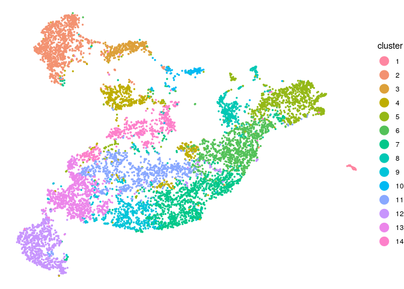

Using STvEA to analyze CODEX data
================

``` r
library(STvEA)
```

Read in CODEX data
------------------

Data taken from FCS files at <http://welikesharingdata.blob.core.windows.net/forshare/index.html>

``` r
data("codex_balbc1")
protein_expr <- cbind(codex_balbc1[, 1:29], MHCII=codex_balbc1$MHCII)
blanks <- codex_balbc1[,grepl("blank", colnames(codex_balbc1))]
size <- codex_balbc1$size.size

# xy coordinates are relative to tile currently, make them absolute
x <- codex_balbc1$X.X
x <- floor((codex_balbc1$tile_nr.tile_nr-1)/9) * max(codex_balbc1$X.X) + x
y <- codex_balbc1$Y.Y
y <- ((codex_balbc1$tile_nr.tile_nr - 1) %% 9) * max(codex_balbc1$Y.Y) + y
z <- codex_balbc1$Z.Z
spatial <- cbind(x,y,z)
row.names(spatial) <- row.names(protein_expr)
```

### Take corner section of CODEX data

``` r
codex_subset <- x < 3000 & y < 3000
protein_expr <- protein_expr[codex_subset,]
blanks <- blanks[codex_subset,]
size <- size[codex_subset]
spatial <- spatial[codex_subset,]
```

Create object to hold data
--------------------------

The STvEA.data class conveniently handles the required data frames and matrices between function calls.

``` r
stvea_object <- SetDataCODEX(codex_protein = protein_expr, codex_blanks = blanks, codex_size = size, codex_spatial = as.data.frame(spatial))
```

Filter and clean protein protein\_expr
--------------------------------------

``` r
# Remove cells that are too small or large, or have too low or too high expression in the blank channels. If lower and upper limits aren't specified, quantiles are taken as the limits.
# Normalize data by the total counts per cell
stvea_object <- FilterCODEX(stvea_object, size_lim = c(1000,25000), blank_lower = c(-1200, -1200, -1200, -1200), blank_upper = c(6000,2500,5000,2500))

# Fit a Gaussian mixture model to the expression levels of each protein, new data will be the cumulative probability according to the Gaussian with the higher mean
stvea_object <- CleanCODEX(stvea_object)
```

Cluster CODEX cells based on protein expression
-----------------------------------------------

This will take around 5 minutes for ~10000 cells

``` r
# Computes the 2 dimensional UMAP embedding of the cleaned CODEX protein expression for later visualization. UMAP also returns the KNN indices with k = n_neighbors.
stvea_object <- GetUmapCODEX(stvea_object, metric = 'pearson', n_neighbors=30, min_dist=0.1, negative_sample_rate = 50)

# Use the KNN indices from UMAP to perform Louvain clustering
stvea_object <- ClusterCODEX(stvea_object, k=30)
```

Visualize clustering and protein expression on UMAP
---------------------------------------------------

``` r
PlotClusterCODEXemb(stvea_object)
```


``` r
PlotExprCODEXemb(stvea_object, c("CD4","B220"))
```


``` r
PlotExprCODEXspatial(stvea_object, c("CD4","B220"))
```


Assess colocalization of clusters
---------------------------------

``` r
cluster_adj <- AdjScoreClustersCODEX(stvea_object, k=3)
```

    ## Creating permutation matrices - 0.032 seconds
    ## Computing adjacency score for each feature pair - 0.424 seconds

``` r
AdjScoreHeatmap(cluster_adj)
```



``` r
protein_adj <- AdjScoreProteins(stvea_object, k=3, num_cores=8)
```

    ## Creating permutation matrices - 10.842 seconds
    ## Computing adjacency score for each feature pair - 35.013 seconds

``` r
AdjScoreHeatmap(protein_adj)
```


