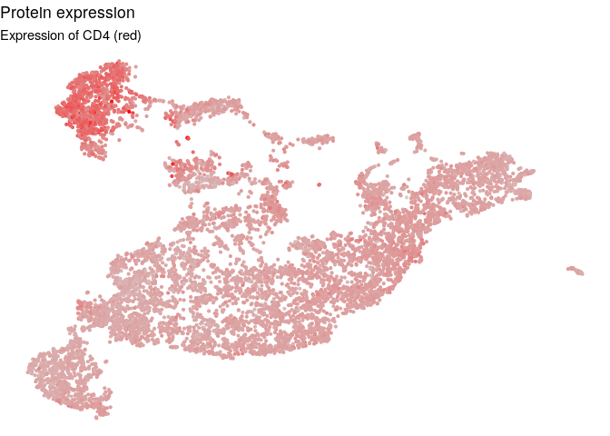
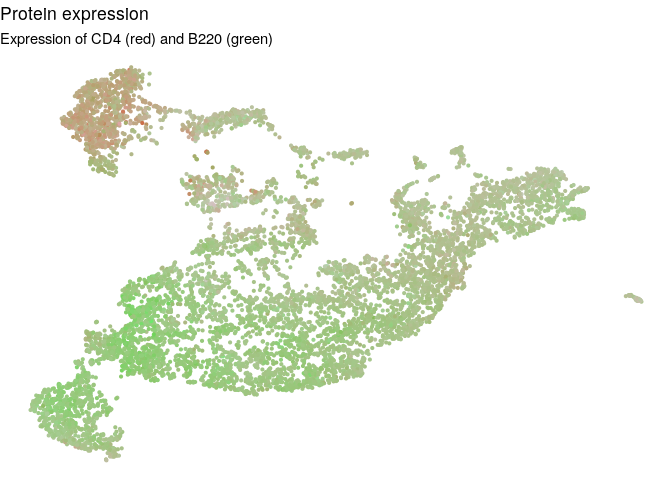
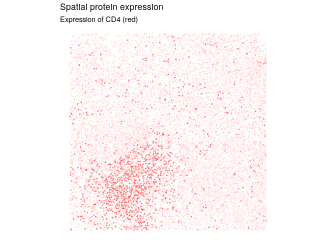

Using STvEA to analyze CODEX data
================

``` r
library(STvEA)
```

    ## Warning: replacing previous import 'Matrix::expm' by 'expm::expm' when
    ## loading 'AdjacencyScore'

Read in CODEX data
------------------

Dataframe converted from FCS files at <http://welikesharingdata.blob.core.windows.net/forshare/index.html>

``` r
data("codex_balbc1")
protein_expr <- cbind(codex_balbc1[, 1:29], MHCII=codex_balbc1$MHCII)
blanks <- codex_balbc1[,grepl("blank", colnames(codex_balbc1))]
size <- codex_balbc1$size.size

# xy coordinates are currently relative to tile, we want them absolute
x <- codex_balbc1$X.X
x <- floor((codex_balbc1$tile_nr.tile_nr-1)/9) * max(codex_balbc1$X.X) + x
y <- codex_balbc1$Y.Y
y <- ((codex_balbc1$tile_nr.tile_nr - 1) %% 9) * max(codex_balbc1$Y.Y) + y
z <- codex_balbc1$Z.Z
spatial <- cbind(x,y,z)
row.names(spatial) <- row.names(protein_expr)
```

### Take corner section of CODEX data

The clustering and Adjacency Score functions are fairly slow on large numbers of cells.

``` r
codex_subset <- x < 3000 & y < 3000
protein_expr <- protein_expr[codex_subset,]
blanks <- blanks[codex_subset,]
size <- size[codex_subset]
spatial <- spatial[codex_subset,]
```

Create object to hold data
--------------------------

The STvEA.data class conveniently handles the required data frames and matrices between function calls.

``` r
stvea_object <- SetDataCODEX(codex_protein = protein_expr,
                             codex_blanks = blanks,
                             codex_size = size,
                             codex_spatial = as.data.frame(spatial))
```

Filter and clean protein protein\_expr
--------------------------------------

Remove cells that are too small or large, or have too low or too high expression in the blank channels. If lower and upper limits aren't specified, quantiles are taken as the limits. Then normalize data by the total counts per cell

``` r
stvea_object <- FilterCODEX(stvea_object, size_lim = c(1000,25000),
                            blank_lower = c(-1200, -1200, -1200, -1200),
                            blank_upper = c(6000,2500,5000,2500))
```

Fit a Gaussian mixture model to the expression levels of each protein. New data will be the cumulative probability according to the Gaussian with the higher mean

``` r
stvea_object <- CleanCODEX(stvea_object)
```

Cluster CODEX cells based on protein expression
-----------------------------------------------

Compute the 2 dimensional UMAP embedding of the cleaned CODEX protein expression for later visualization. UMAP also returns the KNN indices with k = n\_neighbors.

``` r
# This will take around 5 minutes for ~10000 cells
stvea_object <- GetUmapCODEX(stvea_object, metric = 'pearson', n_neighbors=30,
                             min_dist=0.1, negative_sample_rate = 50)
```

Use the KNN indices from UMAP to perform Louvain clustering

``` r
stvea_object <- ClusterCODEX(stvea_object, k=30)
```

Visualize clustering and protein expression on UMAP
---------------------------------------------------

Color each cell in the CODEX UMAP embedding with its cluster assignment. Cells in gray were not assigned to any cluster.

``` r
PlotClusterCODEXemb(stvea_object)
```


Color each cell in the CODEX UMAP embedding with its expression level of proteins. One or two protein names can be input. If two protein names are provided, color will be interpolated between red and green color values.

``` r
PlotExprCODEXemb(stvea_object, c("CD4","B220"))
```


Color the CODEX spatial slide with the expression level of proteins. One or two protein names can be input. If two protein names are provided, color will be interpolated between red and green color values.

``` r
PlotExprCODEXspatial(stvea_object, c("CD4","B220"))
```



Assess colocalization of clusters
---------------------------------

Run the Adjacency Score (<https://github.com/CamaraLab/AdjacencyScore>) to evaluate how often two features take high values in adjacent nodes in a KNN graph of the CODEX spatial dimensions.

Assess which pairs of clusters often appear in adjacent cells

``` r
cluster_adj <- AdjScoreClustersCODEX(stvea_object, k=3)
```

    ## Creating permutation matrices - 0.035 seconds
    ## Computing adjacency score for each feature pair - 0.411 seconds

``` r
AdjScoreHeatmap(cluster_adj)
```



Assess which pairs of proteins are often highly expressed in adjacent cells

``` r
protein_adj <- AdjScoreProteins(stvea_object, k=3, num_cores=8)
```

    ## Creating permutation matrices - 10.863 seconds
    ## Computing adjacency score for each feature pair - 36.784 seconds

``` r
AdjScoreHeatmap(protein_adj)
```


