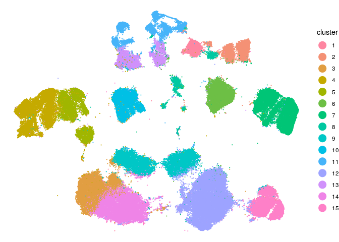
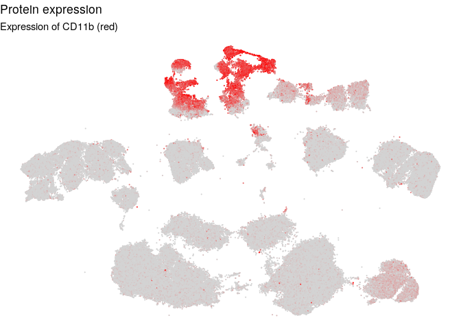
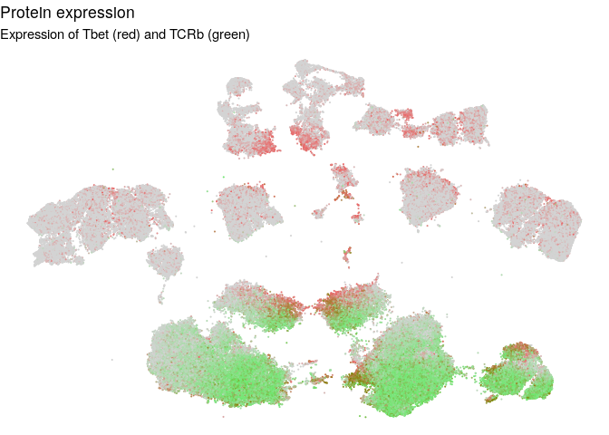

Using STvEA to analyze CyTOF data
================

``` r
library(STvEA)
set.seed(4068)
```

Read in CyTOF data
==================

Dusoswa et al. used CyTOF to profile splenocytes in a glioma mouse model (<https://doi.org/10.1073/pnas.1907921117>). We downloaded the FCS files of their dataset from Cytobank. All STvEA functions called "CODEX" or "codex\_" can be equally used with CyTOF data, except those relating to spatial plotting.

``` r
cytof_names <- ReadNamesFCS("../data/MGL02_Spleen_Live_cells.fcs")[["channels"]]
print(cytof_names)
```

    ##  [1] "Time"         "Event_length" "CD45"         "bc1"         
    ##  [5] "bc2"          "bc3"          "bc4"          "bc5"         
    ##  [9] "bc6"          "112Cd"        "114Cd"        "116Cd"       
    ## [13] "131Xe"        "140Ce"        "Ly6G.C.Gr1"   "CD185.CXCR5" 
    ## [17] "CD69"         "CD16.32"      "CD4"          "CD5"         
    ## [21] "CD36"         "CD11b"        "CD19"         "Ly6C"        
    ## [25] "CD28"         "CD3e"         "CD335.NKp46"  "CD152.CTLA4" 
    ## [29] "CD274 PD-L1"  "F4.80"        "FoxP3"        "CD279 PD-1"  
    ## [33] "CD62L"        "Tbet"         "CD366.TIM3"   "CD54"        
    ## [37] "Ly6AE"        "CCR2"         "SiglecH"      "CD150"       
    ## [41] "CD8a"         "TCRb"         "CD154.CD40L"  "CD44"        
    ## [45] "Ki-67"        "GFP"          "CD229"        "CD127.IL7Ra" 
    ## [49] "CD49d"        "190BCKG"      "DNA"          "DNA"         
    ## [53] "194Pt"        "livedead"     "198Pt"        "208Pb"       
    ## [57] "CD11c"        "Center"       "Offset"       "Width"       
    ## [61] "Residual"

``` r
is_blank <- rep(FALSE, length(cytof_names)) # there are no blank channels
is_protein <- !grepl("Time|Event|Center|Offset|Width|Residual|DNA|livedead|bc|^[0-9]|GFP",cytof_names)
stvea_object <- ReadDataFCS("../data/MGL02_Spleen_Live_cells.fcs", is_protein, is_blank,
                            protein_names = cytof_names[is_protein])
```

    ## Warning in ReadDataFCS("../data/MGL02_Spleen_Live_cells.fcs", is_protein, :
    ## No columns are labelled as blank, setting blank channel data to all 0s

    ## Warning in ReadDataFCS("../data/MGL02_Spleen_Live_cells.fcs", is_protein, :
    ## Cannot find x,y,z coordinates in FCS. Continuing without spatial
    ## information

    ## Warning in ReadDataFCS("../data/MGL02_Spleen_Live_cells.fcs", is_protein, :
    ## Cannot find size information in FCS, setting all cell size to 0

``` r
print(dim(stvea_object@codex_protein))
```

    ## [1] 146119     36

There is no need to filter without blanks or cell size information
==================================================================

``` r
stvea_object <- FilterCODEX(stvea_object)
print(dim(stvea_object@codex_protein)) # The filtering function does not remove any cells
```

    ## [1] 146119     36

Clean CyTOF data
================

Multiple articles reference the default Fluidigm CyTOF software randomizing counts by adding a value uniformly sampled from \[-1,0\]. Thus we take the ceiling of the CyTOF values and fit a negative binomial distribution. If this doesn't work, we can instead apply a standard arcsinh transformation. References: <https://doi.org/10.1002/cyto.a.23908>, <https://biosurf.org/cytof_data_scientist.html>

``` r
# Fit negative binomial
stvea_object <- CleanCODEX(stvea_object, model="nb", normalize=FALSE, num_cores=8) # set num_cores to 1 on Windows

# Alternatively, apply arcsinh transformation
#stvea_object <- CleanCODEX(stvea_object, model="arcsinh")
```

Cluster CyTOF cells based on protein expression
-----------------------------------------------

We use UMAP to compute the 2 dimensional embedding of the cleaned CyTOF protein expression for later visualization. The call to UMAP also returns the KNN indices with k = n\_neighbors. This function call will take over an hour for almost 150,000 cells. Decrease the negative\_sample\_rate to speed it up.

``` r
stvea_object <- GetUmapCODEX(stvea_object, metric = 'pearson', n_neighbors=30,
                             min_dist=0.1, negative_sample_rate = 50)
```

We perform Louvain clustering on a KNN graph of the CyTOF cells, built from the KNN indices returned by UMAP. If k is provided, it must be less than or equal to n\_neighbors from above. If it is not provided, it is set equal to n\_neighbors.

``` r
stvea_object <- ClusterCODEX(stvea_object, k=30)
```

Visualize clustering and protein expression
-------------------------------------------

Color each cell in the CyTOF UMAP embedding with its cluster assignment. Cells in gray were not assigned to any cluster.

``` r
PlotClusterCODEXemb(stvea_object, pt_size=0.1)
```



Color each cell in the CyTOF UMAP embedding with its expression level of proteins. One or two protein names can be input. If two protein names are provided, color will be interpolated between red and green color values.

``` r
PlotExprCODEXemb(stvea_object, "CD11b", pt_size=0.1)
```



``` r
PlotExprCODEXemb(stvea_object, c("Tbet","TCRb"), pt_size=0.1)
```


