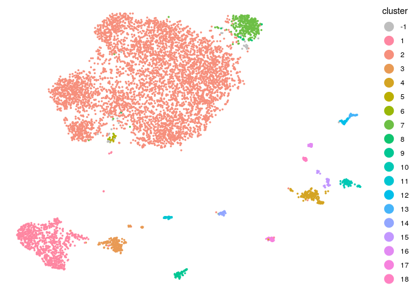
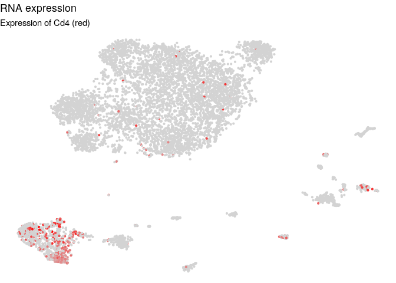
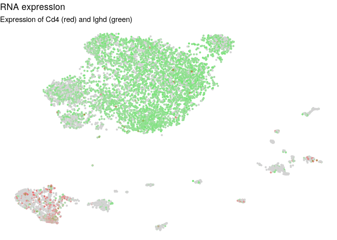
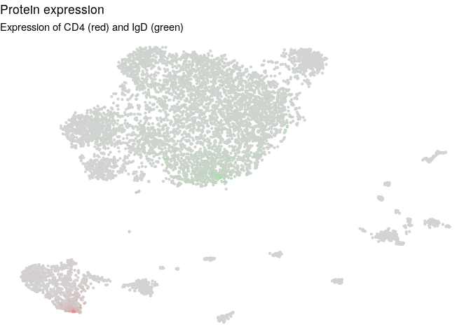
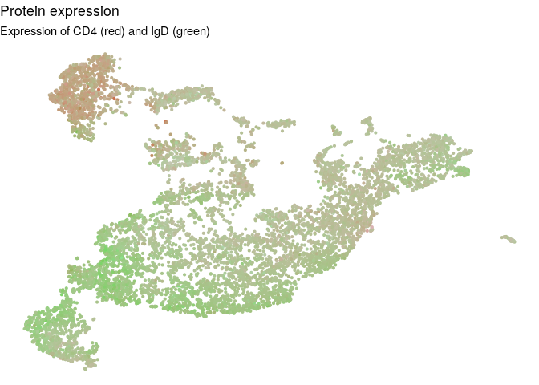
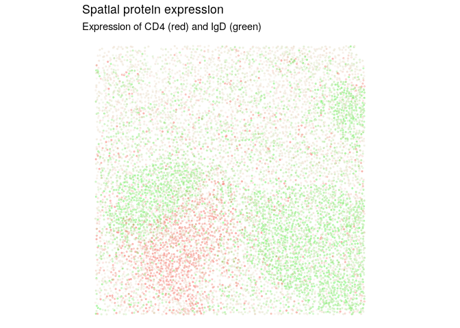
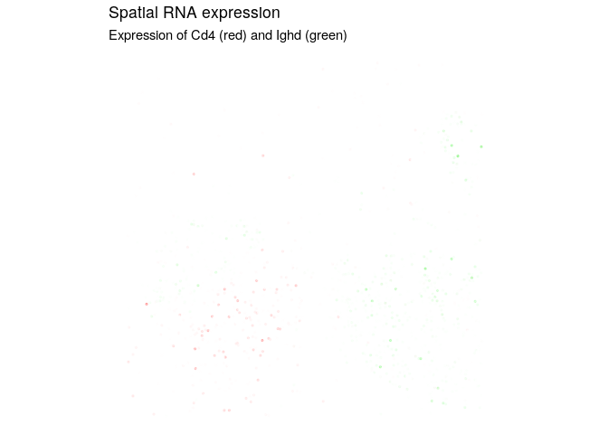
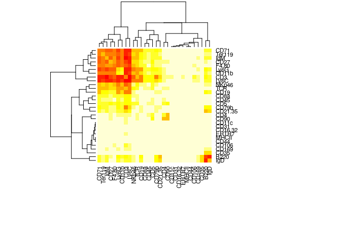
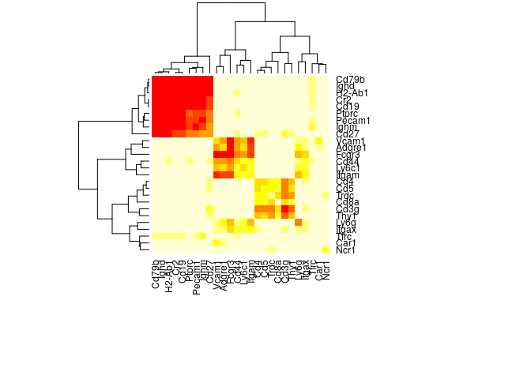

Using STvEA to map CODEX and CITE-seq data
================

Goltsev et al. used CODEX to image the protein expression of tissue sections from 3 normal BALBc mice ( <https://www.cell.com/cell/fulltext/S0092-8674(18)30904-8> ). In our recent preprint, Govek & Troisi et al. (<https://www.biorxiv.org/content/10.1101/672501v1>), we used CITE-seq to produce single cell mRNA and protein expression data from mice matching those in the CODEX data from Goltsev et al.

The raw filtered count matrices for both protein and mRNA expression from CITE-seq are available from these links:

CITE-seq mRNA expression matrix for both mice: <https://www.dropbox.com/s/910hhahxsbd9ofs/gene_matrix_all_new.csv?dl=1>

CITE-seq protein expression matrix for both mice: <https://www.dropbox.com/s/xzobh2p13cqt4y5/protein_expr_all.csv?dl=1>

``` r
library(STvEA)
```

Read in CODEX data
------------------

We downloaded the segmented and spillover corrected data from Goltsev et al. as FCS files from <http://welikesharingdata.blob.core.windows.net/forshare/index.html>. Here we load the expression of the protein and blank channels, cell size, and spatial coordinates from that file.

``` r
data("codex_balbc1")
```

### Convert CODEX spatial coordinates from voxels to nm

We want the z dimension to be in the same units as the x and y dimensions for nearest neighbor computations, so we convert the stacks and voxels to nm.

``` r
codex_spatial$x <- codex_spatial$x - (min(codex_spatial$x) - 1)
codex_spatial$y <- codex_spatial$y - (min(codex_spatial$y) - 1)

codex_spatial_nm <- as.data.frame(cbind(x=codex_spatial$x*188, y=codex_spatial$y*188, z=codex_spatial$z*900))
```

### Take corner section of CODEX data

Some functions in the following analysis are fairly slow on large numbers of cells, so for this tutorial we take a subset of the CODEX cells. It is important to subset the cells in a section of the slide rather than randomly sampling, so that analyses on neighboring cells are accurate.

``` r
codex_subset <- codex_spatial$x < 3000 & codex_spatial$y < 3000
codex_protein <- codex_protein[codex_subset,]
codex_blanks <- codex_blanks[codex_subset,]
codex_size <- codex_size[codex_subset]
codex_spatial_nm <- codex_spatial_nm[codex_subset,]
```

Read in CITE-seq data
---------------------

We read in the protein and mRNA count matrices, plus the mRNA latent space computed by scVI. The count matrices contain the raw expression counts of cells from both mice and have undergone preprocessing filtering (see "Single-cell CITE-seq processing" from Methods of Govek & Troisi et al. <https://www.biorxiv.org/content/10.1101/672501v1>).

``` r
# CITE-seq protein
cite_protein <- read.table("https://www.dropbox.com/s/xzobh2p13cqt4y5/protein_expr_all.csv?dl=1",
                           sep=",", row.names=1, header=TRUE, stringsAsFactors = FALSE)
cite_protein <- as.data.frame(t(cite_protein))
colnames(cite_protein) <- sapply(colnames(cite_protein), function(x) gsub("ADT_", "", x))

# CITE-seq mRNA
cite_mRNA <- read.table("https://www.dropbox.com/s/910hhahxsbd9ofs/gene_matrix_all_new.csv?dl=1",
                        row.names=1, header=TRUE, sep=",", stringsAsFactors = FALSE)
genes <- read.table("https://www.dropbox.com/s/11dmp8ki6tui2zu/genes.tsv?dl=1",
                    row.names=1, header=FALSE, sep="\t", stringsAsFactors = FALSE)
# Convert Ensembl to gene name
cite_mRNA <- as.data.frame(t(cite_mRNA))
col_names <- genes[colnames(cite_mRNA),1]
cite_mRNA <- cite_mRNA[,!duplicated(col_names)]
col_names <- col_names[!duplicated(col_names)]
colnames(cite_mRNA) <- col_names

# CITE-seq mRNA latent space, such as output by scVI
cite_latent <- read.table("https://www.dropbox.com/s/00ezacd6niunoem/latent_output_v2.txt?dl=1",
                          sep=",", header=FALSE, row.names=1, stringsAsFactors = F)
```

Create object to hold data
--------------------------

We use the STvEA.data class to conveniently handle the required data frames and matrices between function calls. We create an object by first adding the data from CODEX: the expression levels from the protein channels after segmentation and spillover correction, the expression levels from the blank channels, the size of each cell according to the segmentation algorithm, and the xyz coordinates of each cell.

We then add the data from CITE-seq, using the stvea\_object parameter to add this data to the existing object. The CITE-seq data must include raw mRNA counts and raw protein counts for each cell, and may also include a latent space for the mRNA data and normalized mRNA expression values. If normalized mRNA expression values are not provided, they are calculated as log(1+TPM) where TPM is 10000 times the expression counts divided by the total counts per cell.

``` r
stvea_object <- SetDataCODEX(codex_protein = codex_protein,
                             codex_blanks = codex_blanks,
                             codex_size = codex_size,
                             codex_spatial = codex_spatial_nm)
stvea_object <- SetDataCITE(cite_mRNA = cite_mRNA,
                            cite_protein = cite_protein,
                            cite_latent = cite_latent,
                            stvea_object = stvea_object)
```

Filter and clean CODEX protein expression
-----------------------------------------

We follow the gating strategy in Goltsev et al. to remove cells that are too small or large, or have too low or too high expression in the blank channels. If the limits aren't specified, the 0.025 and 0.99 quantiles are taken as the lower and upper bounds on size, and the 0.002 and 0.99 quantiles are used for the blank channel expression. We then normalize the protein expression values by the total expression per cell.

``` r
stvea_object <- FilterCODEX(stvea_object, size_lim = c(1000, 25000),
                            blank_lower = c(-1200, -1200, -1200, -1200),
                            blank_upper = c(6000, 2500, 5000, 2500))
```

We remove noise from the CODEX protein expression by first fitting a Gaussian mixture model to the expression levels of each protein. The signal expression is taken as the cumulative probability according to the Gaussian with the higher mean.

``` r
stvea_object <- CleanCODEX(stvea_object)
```

Clean and normalize CITE-seq protein expression
-----------------------------------------------

We follow a similar approach for removing noise in the CITE-seq protein expression as we used for the CODEX data. We fit a negative binomial mixture model to the expression counts of each protein, then take the signal expression as the cumulative probability according to the Negative Binomial with the higher median.

The resulting probability can then optionally be divided by the total protein expression counts per cell to reduce artifacts caused by differing cell sizes. If the *normalize* parameter is set to FALSE, this step will be skipped.

``` r
# This will take around 10 minutes
stvea_object <- CleanCITE(stvea_object, num_cores=8, normalize=TRUE)
```

Fitting a negative binomial model required raw counts for the protein expression data, so batch correction may optionally be performed after the noise cleaning step. To do so, use a separate batch correction algorithm, such as mnnCorrect from Haghverdi et al. (<https://www.nature.com/articles/nbt.4091>) on the stvea\_object@cite\_clean matrix, then set stvea\_object@cite\_clean to be the corrected output of that algorithm. The rest of the STvEA mapping algorithm will work best if the protein expression values after batch correction are rescaled to \[0,1\].

Cluster CITE-seq cells based on mRNA expression
-----------------------------------------------

We use UMAP to compute a 2 dimensional embedding of the CITE-seq mRNA latent space for later visualization.

``` r
stvea_object <- GetUmapCITE(stvea_object, metric = 'pearson',
                            n_neighbors = 50, min_dist=0.1,
                            negative_sample_rate=50)
```

We cluster the CITE-seq cells based on their mRNA expression using a consensus of HDBSCAN clusterings. First, we run UMAP on the CITE-seq latent space to the same number of dimensions (running UMAP before density based clustering is suggested in the UMAP documentation <https://umap-learn.readthedocs.io/en/latest/clustering.html>). We perform a scan over the two parameters of the Python HDBSCAN implementation, min\_cluster\_size and min\_samples (more information on selecting these paramters <https://hdbscan.readthedocs.io/en/latest/parameter_selection.html>).

``` r
stvea_object <- ParameterScan(stvea_object, min_cluster_size_range = seq(5,20,4),
                              min_sample_range = seq(10,40,3), n_neighbors=50,
                              min_dist=0.1, negative_sample_rate=50,
                              metric = 'pearson')
```

    ## Running UMAP on the CITE-seq latent space
    ## Running HDBSCAN on the UMAP space


We create a dissimilarity matrix between cells as the number of HDBSCAN clusterings (passing a certain silhouette cutoff) in which they are assigned to the same cluster. The final consensus clusters are an agglomerative clustering on this dissimilarity matrix using Python's scipy.cluster.hierarchy, cutting the tree using the inconsistent value. We remove all clusters that have fewer than 10 cells, caused by the cells that HDBSCAN did not assign to any cluster.

``` r
stvea_object <- ConsensusCluster(stvea_object, silhouette_cutoff = 0.114,
                                 inconsistent_value = 0.1, min_cluster_size = 10)
```

Cluster CODEX cells based on protein expression
-----------------------------------------------

We use UMAP to compute the 2 dimensional embedding of the cleaned CODEX protein expression for later visualization. The call to UMAP also returns the KNN indices with k = n\_neighbors.

``` r
# This will take around 5 minutes for ~10000 cells
stvea_object <- GetUmapCODEX(stvea_object, metric = 'pearson', n_neighbors=30,
                             min_dist=0.1, negative_sample_rate = 50)
```

We perform Louvain clustering on a KNN graph of the CODEX cells, built from the KNN indices returned by UMAP. If k is provided, it must be less than or equal to n\_neighbors from above. If it is not provided, it is set equal to n\_neighbors.

``` r
stvea_object <- ClusterCODEX(stvea_object, k=30)
```

Map CITE-seq and CODEX protein
------------------------------

We map the CODEX protein space to the CITE-seq protein space using a modified version of the anchor correction proposed by Stuart et al. (<https://www.biorxiv.org/content/10.1101/460147v1>) and implemented in Seurat's IntegrateData function.

``` r
stvea_object <- MapCODEXtoCITE(stvea_object, num_chunks=8, seed=30, num_cores=4)
```

Create neighbor matrices
------------------------

In order to map features between the CITE-seq and CODEX datasets, we create transfer matrices between the CODEX and CITE-seq cells using the shared protein space created by the anchor correction above. The two transfer matrices contain the k CITE-seq nearest neighbors for each CODEX cell and k CODEX nearest neighbors for each CITE-seq cell respectively.

``` r
stvea_object <- GetTransferMatrix(stvea_object)
```

Visualize clustering, mRNA, and protein expression
--------------------------------------------------

### Color each cell in the CITE-seq UMAP embedding with its cluster assignment.

Cells in gray were not assigned to any cluster.

``` r
PlotClusterCITE(stvea_object)
```



### Color each cell in the CITE-seq UMAP embedding with its expression level of one or two genes.

``` r
PlotExprCITE(stvea_object, "Cd4", type="RNA")
```



If two gene names are provided, color will be interpolated between red and green color values.

``` r
PlotExprCITE(stvea_object, c("Cd4", "Ighd"), type="RNA")
```



### Color each cell in the CITE-seq UMAP embedding with its expression level of one or two proteins.

``` r
PlotExprCITE(stvea_object, c("CD4","IgD"), type="protein")
```



### Color each cell in the CODEX UMAP embedding with its cluster assignment.

Cells in gray were not assigned to any cluster.

``` r
PlotClusterCODEXemb(stvea_object)
```


### Color each cell in the CODEX UMAP embedding with its expression level of one or two proteins.

``` r
PlotExprCODEXemb(stvea_object, c("CD4","IgD"))
```



### Color the CODEX spatial slide with the expression level of one or two proteins.

``` r
PlotExprCODEXspatial(stvea_object, c("CD4","IgD"))
```



### Color the CODEX spatial slide with the expression level of one or two genes that were mapped from the CITE-seq expression levels.

``` r
PlotExprCODEXspatial(stvea_object, c("Cd4", "Ighd"), type="RNA")
```



Assess colocalization of features
---------------------------------

The Adjacency Score (<https://github.com/CamaraLab/AdjacencyScore>) can be used to evaluate how often two features (cluster assignments, proteins, genes) take high values in adjacent nodes in a KNN graph of the CODEX spatial dimensions:

### Which pairs of proteins are often highly expressed in adjacent cells?

Since we are computing the Adjacency Score of every combination of features (clusters), we can plot a heatmap of the scores, where each cell in the heatmap represents the significance of the Adjacency Score between the row feature and the column feature.

``` r
protein_adj <- AdjScoreProteins(stvea_object, k=3, num_cores=8)
```

    ## Creating permutation matrices - 8.31 seconds
    ## Computing adjacency score for each feature pair - 38.828 seconds

``` r
AdjScoreHeatmap(protein_adj)
```



### Which pairs of genes often have high expression mapped to adjacent CODEX cells?

There are too many genes to compute the Adjacency Score for all combinations, so we compute it for all pairs of genes corresponding to one of the proteins so that we can visualized the results on a heatmap.

``` r
gene_list <- c("Ptprc", "Ly6c1", "Trdc", "Ly6g", "Cd19", "Vcam1", "Cd3g",
               "Fcgr3", "Cd8a", "Thy1", "Adgre1", "Itgax", "Car1", "Itgam",
               "Ighd", "Cd27", "Cd5", "Cd79b", "Tfrc", "Pecam1", "Cd4",
               "Ighm", "Cr2", "Cd44", "Ncr1", "H2-Ab1")
gene_pairs <- t(combn(gene_list,2))
for (gene in gene_list) {
  gene_pairs <- rbind(gene_pairs, c(gene,gene))
}
gene_adj <- AdjScoreGenes(stvea_object, gene_pairs,  k=3, num_cores=8)
```

    ## Creating permutation matrices - 7.69 seconds
    ## Computing adjacency score for each feature pair - 45.476 seconds

``` r
AdjScoreHeatmap(gene_adj)
```



### Which pairs of CODEX clusters often appear in adjacent cells?

Since the assignment of a cell to a cluster is a binary feature which is mutually exclusive with all other cluster assignments, the null distribution used to assess significance can be parameterized as a hypergeometric distribution, providing a significant speedup.

``` r
codex_cluster_adj <- AdjScoreClustersCODEX(stvea_object, k=3)
```

    ## Creating permutation matrices - 0.009 seconds
    ## Computing adjacency score for each feature pair - 0.501 seconds

``` r
AdjScoreHeatmap(codex_cluster_adj)
```


### Which pairs of clusters from the CITE-seq mRNA analysis are often mapped to adjacent CODEX cells?

These mapped cluster assignments are not mutually exclusive like the ones above, since the uncertainty in the mapping and similar cluster expression patterns require that we assign each cell to a proportion of clusters, not just one. Therefor we cannot use the speedup mentioned above.

``` r
#cite_cluster_adj <- AdjScoreClustersCITE(stvea_object, k=3, num_cores=8)
#AdjScoreHeatmap(cite_cluster_adj)
```
