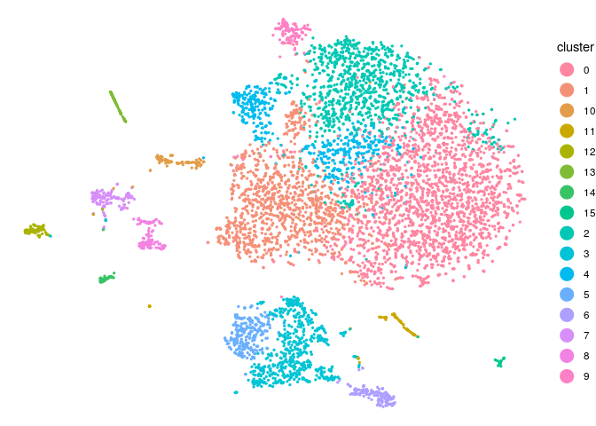
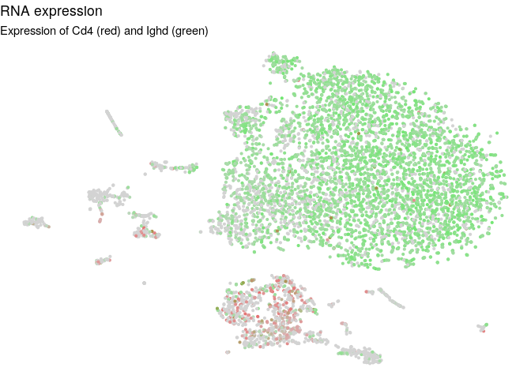
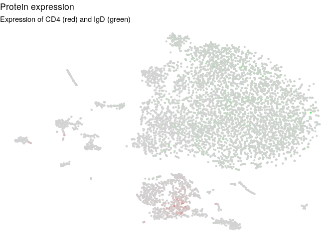
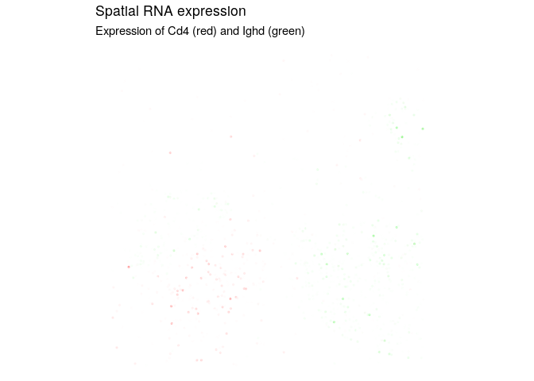
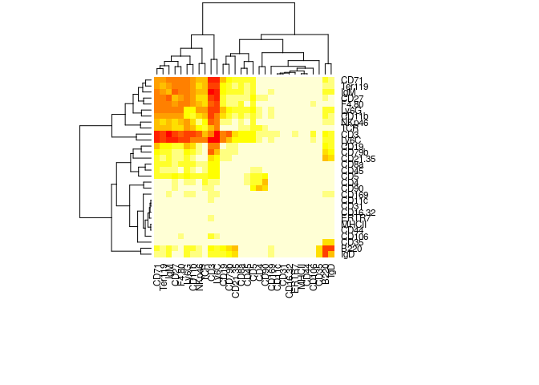
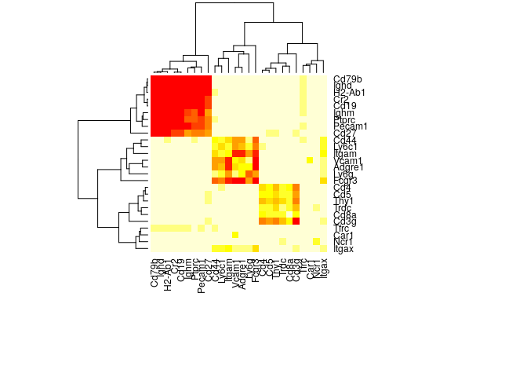
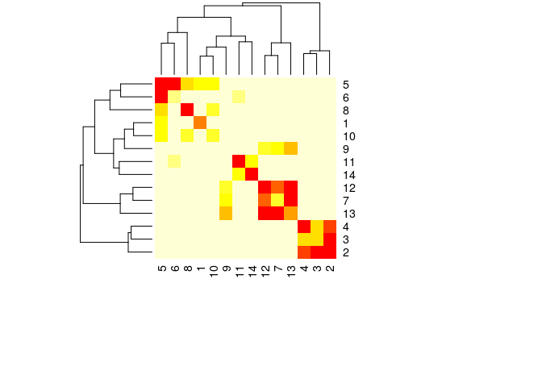
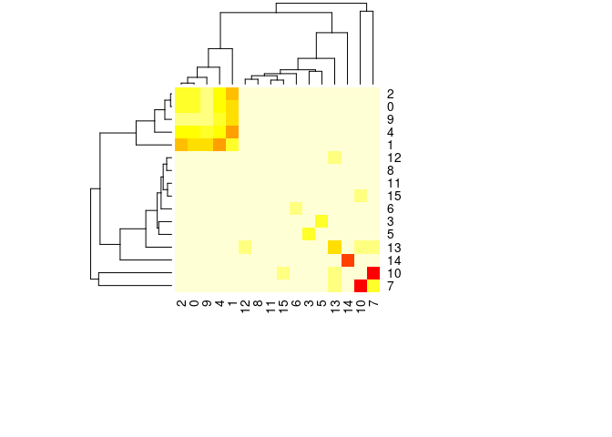

Using STvEA to analyze CITE-seq data from a Seurat object
================

Goltsev et al. used CODEX to image the protein expression of tissue sections from 3 normal BALBc mice ( <https://www.cell.com/cell/fulltext/S0092-8674(18)30904-8> ). In our recent preprint, Govek & Troisi et al. (<https://www.biorxiv.org/content/10.1101/672501v1>), we used CITE-seq to produce single cell mRNA and protein expression data from mice matching those in the CODEX data from Goltsev et al.

The raw filtered count matrices for both protein and mRNA expression from CITE-seq are available from these links:

CITE-seq mRNA expression matrix for both mice: <https://www.dropbox.com/s/910hhahxsbd9ofs/gene_matrix_all_new.csv?dl=1>

CITE-seq protein expression matrix for both mice: <https://www.dropbox.com/s/xzobh2p13cqt4y5/protein_expr_all.csv?dl=1>

``` r
library(STvEA)
```

Read in CODEX data
------------------

Goltsev et al. used CODEX to image the protein expression of tissue sections from 3 normal BALBc mice ( <https://www.cell.com/cell/fulltext/S0092-8674(18)30904-8> ). We downloaded their segmented and spillover corrected data as FCS files from <http://welikesharingdata.blob.core.windows.net/forshare/index.html>. Here we load the expression of the protein and blank channels, cell size, and spatial coordinates from that file.

``` r
data("codex_balbc1")
```

### Convert CODEX spatial coordinates from voxels to nm

We want the z dimension to be in the same units as the x and y dimensions for nearest neighbor computations, so we convert the stacks and voxels to nm.

``` r
codex_spatial$x <- codex_spatial$x - (min(codex_spatial$x) - 1)
codex_spatial$y <- codex_spatial$y - (min(codex_spatial$y) - 1)

codex_spatial_nm <- as.data.frame(cbind(x=codex_spatial$x*188, y=codex_spatial$y*188, z=codex_spatial$z*900))
```

### Take corner section of CODEX data

Some functions in the following analysis are fairly slow on large numbers of cells, so for this tutorial we take a subset of the CODEX cells. It is important to subset the cells in a section of the slide rather than randomly sampling, so that analyses on neighboring cells are accurate.

``` r
codex_subset <- codex_spatial$x < 3000 & codex_spatial$y < 3000
codex_protein <- codex_protein[codex_subset,]
codex_blanks <- codex_blanks[codex_subset,]
codex_size <- codex_size[codex_subset]
codex_spatial_nm <- codex_spatial_nm[codex_subset,]
```

Read in CITE-seq data
---------------------

We used CITE-seq to produce single cell mRNA and protein expression data from mice matching those in the CODEX data from Goltsev et al. We then used Seurat v2 to normalize and cluster this data with TSNE and PCA. Detailed instructions on using Seurat to process CITE-seq data can be found in the Seurat online vignettes (<https://satijalab.org/seurat/v2.4/multimodal_vignette.html>). Currently, STvEA can only load in objects from Seurat v2.

``` r
cite_seurat_object <- readRDS(url("https://www.dropbox.com/s/6vh70fid4yqxop4/cite_seurat_object.rds?dl=1"))
```

Create object to hold data
--------------------------

We use the STvEA.data class to conveniently handle the required data frames and matrices between function calls. We create a STvEA object by first loading the data from the Seurat object. Since we used TSNE and PCA to perform dimensionality reduction on the CITE-seq mRNA space, we direct the STvEA.data class to look in those slots of the Seurat object.

We then add the data from CODEX, using the stvea\_object parameter to add this data to the existing object. The CODEX data must include the expression levels from the protein channels after segmentation and spillover correction, the expression levels from the blank channels, the size of each cell according to the segmentation algorithm, and the xyz coordinates of each cell.

``` r
stvea_object <- TransferDataSeurat2(cite_seurat_object,
                                    embedding_reduction="tsne",
                                    latent_reduction="pca",
                                    latent_dims=18)
```

    ## Warning: replacing previous import 'mclust::dmvnorm' by 'mvtnorm::dmvnorm'
    ## when loading 'fpc'

    ## Warning: replacing previous import 'mclust::dmvnorm' by 'mvtnorm::dmvnorm'
    ## when loading 'tclust'

``` r
stvea_object <- SetDataCODEX(codex_protein = codex_protein,
                             codex_blanks = codex_blanks,
                             codex_size = codex_size,
                             codex_spatial = codex_spatial_nm,
                             stvea_object = stvea_object)
```

Filter and clean CODEX protein expression
-----------------------------------------

We follow the gating strategy in Goltsev et al. to remove cells that are too small or large, or have too low or too high expression in the blank channels. If the limits aren't specified, the 0.025 and 0.99 quantiles are taken as the lower and upper bounds on size, and the 0.002 and 0.99 quantiles are used for the blank channel expression. We then normalize the protein expression values by the total expression per cell.

``` r
stvea_object <- FilterCODEX(stvea_object, size_lim = c(1000, 25000),
                            blank_lower = c(-1200, -1200, -1200, -1200),
                            blank_upper = c(6000, 2500, 5000, 2500))
```

We remove noise from the CODEX protein expression by first fitting a Gaussian mixture model to the expression levels of each protein. The signal expression is taken as the cumulative probability according to the Gaussian with the higher mean.

``` r
stvea_object <- CleanCODEX(stvea_object)
```

Clean and normalize CITE-seq protein expression
-----------------------------------------------

We follow a similar approach for removing noise in the CITE-seq protein expression as we used for the CODEX data. We fit a negative binomial mixture model to the expression counts of each protein, then take the signal expression as the cumulative probability according to the Negative Binomial with the higher median.

The resulting probability can then optionally be divided by the total protein expression counts per cell to reduce artifacts caused by differing cell sizes. If the *normalize* parameter is set to FALSE, this step will be skipped.

``` r
# This will take around 10 minutes
stvea_object <- CleanCITE(stvea_object, num_cores=8, normalize=TRUE)
```

Cluster CODEX cells based on protein expression
-----------------------------------------------

We use UMAP to compute the 2 dimensional embedding of the cleaned CODEX protein expression for later visualization. The call to UMAP also returns the KNN indices with k = n\_neighbors.

``` r
# This will take around 5 minutes for ~10000 cells
stvea_object <- GetUmapCODEX(stvea_object, metric = 'pearson', n_neighbors=30,
                             min_dist=0.1, negative_sample_rate = 50)
```

We perform Louvain clustering on a KNN graph of the CODEX cells, built from the KNN indices returned by UMAP. If k is provided, it must be less than or equal to n\_neighbors from above. If it is not provided, it is set equal to n\_neighbors.

``` r
stvea_object <- ClusterCODEX(stvea_object, k=30)
```

Map CITE-seq and CODEX protein
------------------------------

We map the CODEX protein space to the CITE-seq protein space using a modified version of the anchor correction proposed by Stuart et al. (<https://www.biorxiv.org/content/10.1101/460147v1>) and implemented in Seurat's IntegrateData function.

``` r
stvea_object <- MapCODEXtoCITE(stvea_object, num_chunks=8, seed=30, num_cores=4)
```

Create neighbor matrices
------------------------

In order to map features between the CITE-seq and CODEX datasets, we create transfer matrices between the CODEX and CITE-seq cells using the shared protein space created by the anchor correction above. The two transfer matrices contain the k CITE-seq nearest neighbors for each CODEX cell and k CODEX nearest neighbors for each CITE-seq cell respectively.

``` r
stvea_object <- GetTransferMatrix(stvea_object)
```

Visualize clustering, mRNA, and protein expression
--------------------------------------------------

### Color each cell in the CITE-seq UMAP embedding with its cluster assignment.

Cells in gray were not assigned to any cluster.

``` r
PlotClusterCITE(stvea_object)
```



### Color each cell in the CITE-seq UMAP embedding with its expression level of one or two genes.

``` r
PlotExprCITE(stvea_object, "Cd4", type="RNA")
```


If two gene names are provided, color will be interpolated between red and green color values.

``` r
PlotExprCITE(stvea_object, c("Cd4", "Ighd"), type="RNA")
```



### Color each cell in the CITE-seq UMAP embedding with its expression level of one or two proteins.

``` r
PlotExprCITE(stvea_object, c("CD4","IgD"), type="protein")
```



### Color each cell in the CODEX UMAP embedding with its cluster assignment.

Cells in gray were not assigned to any cluster.

``` r
PlotClusterCODEXemb(stvea_object)
```


### Color each cell in the CODEX UMAP embedding with its expression level of one or two proteins.

``` r
PlotExprCODEXemb(stvea_object, c("CD4","IgD"))
```


### Color the CODEX spatial slide with the expression level of one or two proteins.

``` r
PlotExprCODEXspatial(stvea_object, c("CD4","IgD"))
```


### Color the CODEX spatial slide with the expression level of one or two genes that were mapped from the CITE-seq expression levels.

``` r
PlotExprCODEXspatial(stvea_object, c("Cd4", "Ighd"), type="RNA")
```



Assess colocalization of features
---------------------------------

The Adjacency Score (<https://github.com/CamaraLab/AdjacencyScore>) can be used to evaluate how often two features (cluster assignments, proteins, genes) take high values in adjacent nodes in a KNN graph of the CODEX spatial dimensions:

### Which pairs of proteins are often highly expressed in adjacent cells?

Since we are computing the Adjacency Score of every combination of features (clusters), we can plot a heatmap of the scores, where each cell in the heatmap represents the significance of the Adjacency Score between the row feature and the column feature.

``` r
protein_adj <- AdjScoreProteins(stvea_object, k=3, num_cores=8)
```

    ## Creating permutation matrices - 8.417 seconds
    ## Computing adjacency score for each feature pair - 40.876 seconds

``` r
AdjScoreHeatmap(protein_adj)
```



### Which pairs of genes often have high expression mapped to adjacent CODEX cells?

There are too many genes to compute the Adjacency Score for all combinations, so we compute it for all pairs of genes corresponding to one of the proteins so that we can visualized the results on a heatmap.

``` r
gene_list <- c("Ptprc", "Ly6c1", "Trdc", "Ly6g", "Cd19", "Vcam1", "Cd3g",
               "Fcgr3", "Cd8a", "Thy1", "Adgre1", "Itgax", "Car1", "Itgam",
               "Ighd", "Cd27", "Cd5", "Cd79b", "Tfrc", "Pecam1", "Cd4",
               "Ighm", "Cr2", "Cd44", "Ncr1", "H2-Ab1")
gene_pairs <- t(combn(gene_list,2))
for (gene in gene_list) {
  gene_pairs <- rbind(gene_pairs, c(gene,gene))
}
gene_adj <- AdjScoreGenes(stvea_object, gene_pairs,  k=3, num_cores=8)
```

    ## Creating permutation matrices - 7.523 seconds
    ## Computing adjacency score for each feature pair - 47.82 seconds

``` r
AdjScoreHeatmap(gene_adj)
```



### Which pairs of CODEX clusters often appear in adjacent cells?

Since the assignment of a cell to a cluster is a binary feature which is mutually exclusive with all other cluster assignments, the null distribution used to assess significance can be parameterized as a hypergeometric distribution, providing a significant speedup.

``` r
codex_cluster_adj <- AdjScoreClustersCODEX(stvea_object, k=3)
```

    ## Creating permutation matrices - 0.009 seconds
    ## Computing adjacency score for each feature pair - 0.433 seconds

``` r
AdjScoreHeatmap(codex_cluster_adj)
```



### Which pairs of clusters from the CITE-seq mRNA analysis are often mapped to adjacent CODEX cells?

These mapped cluster assignments are not mutually exclusive like the ones above, since the uncertainty in the mapping and similar cluster expression patterns require that we assign each cell to a proportion of clusters, not just one. Therefor we cannot use the speedup mentioned above.

``` r
cite_cluster_adj <- AdjScoreClustersCITE(stvea_object, k=3, num_cores=8)
```

    ## Creating permutation matrices - 6.669 seconds
    ## Computing adjacency score for each feature pair - 17.144 seconds

``` r
AdjScoreHeatmap(cite_cluster_adj)
```


